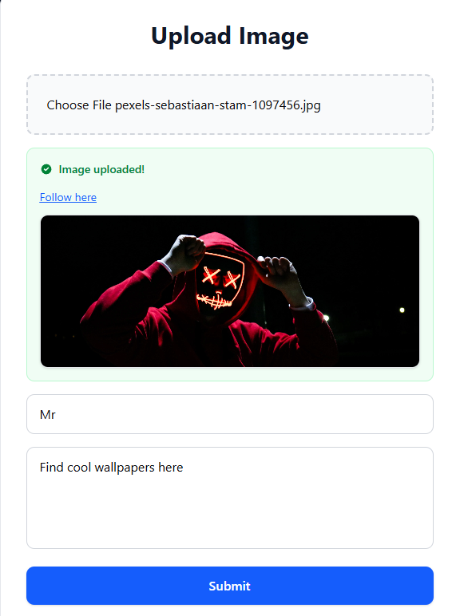
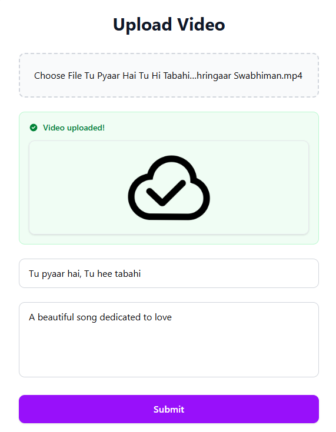
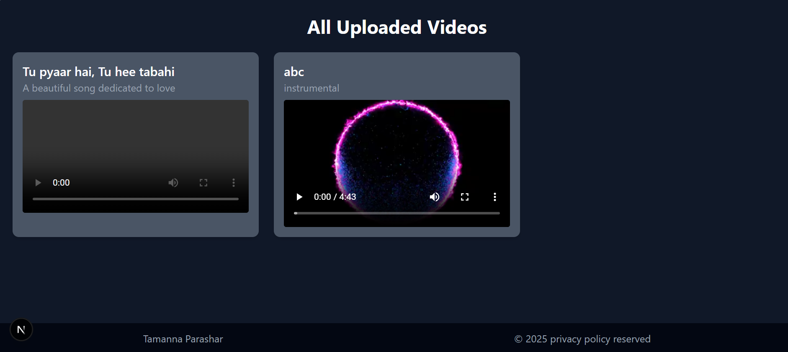

# shorts – A Full-Stack Video & Image Sharing App

**shorts** is a full-stack web application built with **Next.js** that allows users to upload images and videos — similar to YouTube — and browse uploaded videos in a sleek UI.

---

## 🚀 Features

- 🔐 Secure user authentication via **NextAuth**
- 📸 Image uploads using **ImageKit**
- 📹 Video uploads with auto-generated thumbnail support
- 📂 MongoDB-based persistent storage for video metadata
- 💻 Clean, responsive UI for upload and browsing
- 🧠 Built with modern web technologies using **Next.js App Router**

---

## 🛠️ Tech Stack

| Technology  | Purpose                        |
|-------------|--------------------------------|
| Next.js     | Full-stack React framework     |
| MongoDB     | Database to store videos/data  |
| NextAuth.js | Authentication and sessions    |
| ImageKit    | Image/video upload + CDN       |
| Tailwind CSS| Modern, utility-first styling  |

---

## 📸 Screenshots

### 🏠 Home Page with Three Options

- **Add Image**
- **Add Video**
- **Get Videos**

| Feature        | Screenshot |
|----------------|------------|
| ➕ Add Image    |  |
| 🎥 Add Video    |  |
| 📺 Get Videos   |  |

> 💡 Make sure the image paths are valid in your project — store them inside `public/screenshots/`.

---

## ⚙️ Getting Started

### 1. 📥 Clone the repo

```bash
git clone https://github.com/TamannaParashar/shorts.git
cd shorts
```
 ### 2. 📦 Install dependencies
```bash
npm install
# or
yarn
```
### 3. Create .env.local file and add the environment variables

### 4. Run the development server
```bash
npm run dev
```